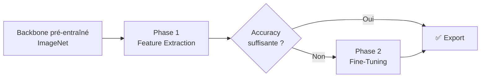
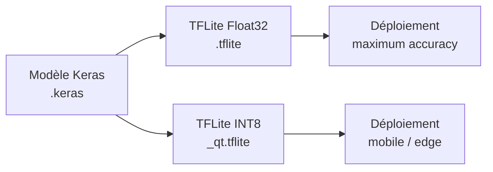

# Transfer Learning

## 1. Principes

Le **transfer learning** consiste à réutiliser un modèle déjà entraîné sur un large dataset (ImageNet, ~14 M d'images, 1 000 classes) et à l'adapter à une nouvelle tâche avec peu de données.

### Pourquoi ça marche ?

Les premières couches d'un réseau de neurones apprennent des **features génériques** (contours, textures, motifs) qui sont utiles pour presque toutes les tâches visuelles. Seules les dernières couches sont spécialisées pour la tâche d'origine.

### Deux approches

| Approche | Principe | Quand l'utiliser |
|---|---|---|
| **Feature Extraction** | Backbone gelé, on entraîne uniquement le classifier head | Petit dataset, premier essai |
| **Fine-Tuning** | On dégèle tout ou partie du backbone et on réentraîne | Quand le feature extraction plafonne |

!!! example "Anti-spoofing"
    Les textures de moiré, les reflets d'écran, les artefacts de compression JPEG sont des features de bas/moyen niveau que le backbone pré-entraîné sait déjà détecter. Il suffit d'entraîner un classifier head pour dire "real" ou "fake".

### Workflow type en Keras

```python
# 1. Charger le backbone pré-entraîné SANS la tête de classification
base_model = keras.applications.MobileNetV3Large(
    weights="imagenet",
    input_shape=(224, 224, 3),
    include_top=False,
)

# 2. Geler le backbone
base_model.trainable = False

# 3. Ajouter un classifier head
inputs = keras.Input(shape=(224, 224, 3))
x = base_model(inputs, training=False)  # training=False → BatchNorm en mode inférence
x = keras.layers.GlobalAveragePooling2D()(x)
x = keras.layers.Dropout(0.2)(x)
outputs = keras.layers.Dense(1, activation="sigmoid")(x)
model = keras.Model(inputs, outputs)
```

!!! warning "BatchNormalization"
    Toujours passer `training=False` au backbone, même après le dégel pour le fine-tuning. Sinon les statistiques BatchNorm seront mises à jour et détruiront les features apprises.

---

## 2. Architectures de base

### MobileNetV3

MobileNetV3 existe en deux variantes : **Large** (meilleure accuracy) et **Small** (ultra-léger).

=== "MobileNetV3-Large"
    | Caractéristique | Détail |
    |---|---|
    | **Taille** | ~22 MB (ImageNet) |
    | **Paramètres** | ~5.4 M |
    | **Innovation** | Depthwise separable conv + squeeze-and-excitation + hard-swish + NAS |
    | **Vitesse** | Très rapide, conçu pour le mobile |
    | **Accuracy (ImageNet)** | ~75.2% top-1 |

=== "MobileNetV3-Small"
    | Caractéristique | Détail |
    |---|---|
    | **Taille** | ~10 MB (ImageNet) |
    | **Paramètres** | ~2.5 M |
    | **Innovation** | Même architecture que Large, optimisée pour la latence minimale |
    | **Vitesse** | Extrêmement rapide, idéal pour les appareils très contraints |
    | **Accuracy (ImageNet)** | ~67.7% top-1 |

### EfficientNet (B0 → B7)

| Caractéristique | Détail |
|---|---|
| **Taille (B0)** | ~29 MB |
| **Paramètres (B0)** | ~5.3 M |
| **Innovation** | Compound scaling (résolution × profondeur × largeur) |
| **Vitesse** | Plus lent que MobileNet, mais meilleure accuracy |
| **Accuracy (B0, ImageNet)** | ~77.1% top-1 |

---

## 3. Dataset — Préparation & Bonnes Pratiques

### Taille recommandée

| Situation | Taille minimale | Taille idéale |
|---|---|---|
| Transfer learning (binaire) | **500–1 000** par classe | **2 000–5 000** par classe |
| Transfer learning (multi-classe) | **200–500** par classe | **1 000+** par classe |
| Entraînement from scratch | **10 000+** par classe | **50 000+** par classe |

!!! info "Règle empirique"
    Pour du transfer learning binaire (real/fake), **1 000 images par classe** est un bon minimum. En dessous, la data augmentation devient indispensable.

### Répartition des données

| Split | Ratio recommandé | Rôle |
|---|---|---|
| **Train** | 70–80% | Entraînement du modèle |
| **Validation** | 10–15% | Suivi pendant l'entraînement, tuning des hyperparamètres |
| **Test** | 10–15% | Évaluation finale, jamais vu pendant l'entraînement |

!!! warning "Erreur fréquente"
    Ne **jamais** tuner les hyperparamètres sur le test set. Si vous le faites, vous n'avez plus de mesure fiable de la performance réelle.

### Équilibrage des classes

Un dataset déséquilibré (ex : 90% real, 10% fake) biaise le modèle vers la classe majoritaire.

**Techniques de rééquilibrage :**

=== "Sous-échantillonnage"
    Réduire la classe majoritaire au niveau de la classe minoritaire.

    - ✅ Simple et rapide
    - ❌ Perte de données potentiellement utiles

=== "Sur-échantillonnage"
    Dupliquer ou augmenter la classe minoritaire.

    - ✅ Pas de perte de données
    - ❌ Risque de sur-apprentissage sur les doublons

=== "Class Weights"
    Pondérer la loss pour pénaliser davantage les erreurs sur la classe minoritaire.

    ```python
    from sklearn.utils.class_weight import compute_class_weight
    import numpy as np

    weights = compute_class_weight(
        "balanced",
        classes=np.array([0, 1]),
        y=train_labels
    )
    class_weight = {0: weights[0], 1: weights[1]}

    model.fit(train_ds, class_weight=class_weight)
    ```

    - ✅ Pas besoin de modifier le dataset
    - ❌ Peut être insuffisant si le déséquilibre est extrême (> 10:1)

!!! example "Anti-spoofing : pièges courants"

    - **Biais de capture** : si toutes les photos "fake" viennent du même écran, le modèle apprend à reconnaître l'écran, pas le fake. → Varier les sources.
    - **Biais temporel** : si les photos real sont récentes et les fake anciennes, le modèle apprend la qualité JPEG. → Mixer les dates.
    - **Ratio déséquilibré** : en production, les fakes sont rares (~5%). Entraîner à 50/50, puis évaluer avec le ratio réel.

---

## 4. Data Augmentation

La data augmentation crée des variations artificielles des images d'entraînement pour améliorer la généralisation.

### Augmentations recommandées pour l'anti-spoofing

| Augmentation | Utilité anti-spoofing | Range recommandé |
|---|---|---|
| **Horizontal Flip** | Invariance gauche-droite des sujets | 50% de probabilité |
| **Brightness Jitter** | Simule différentes conditions de luminosité | ± 0.2 |
| **Contrast Jitter** | Simule les variations d'écran/caméra | ± 0.2 |
| **Saturation Jitter** | Simule les variations de balance des blancs | ± 0.2 |

### Implémentation Keras

```python
augmentation_layers = keras.Sequential([
    keras.layers.RandomFlip("horizontal"),
    keras.layers.RandomBrightness(0.2),
    keras.layers.RandomContrast(0.2),
])
```

!!! tip "Quand activer l'augmentation ?"
    - **Dataset < 2 000 images par classe** → Indispensable
    - **Dataset 2 000 – 10 000** → Recommandé
    - **Dataset > 10 000** → Utile mais moins critique

---

## 5. Pipeline d'entraînement en 2 phases

### Vue d'ensemble



### Phase 1 — Transfer Learning (backbone gelé)

| Paramètre | Valeur recommandée | Notes |
|---|---|---|
| **Backbone** | Gelé (`trainable = False`) | Préserve les features ImageNet |
| **Learning Rate** | `1e-3` (Adam) | Standard pour un classifier head |
| **Epochs** | 10–20 | Suffisant pour converger |
| **Batch Size** | 32 | Bon compromis mémoire/stabilité |

```python
model.compile(
    optimizer=keras.optimizers.Adam(learning_rate=1e-3),
    loss="binary_crossentropy",
    metrics=["accuracy"],
)
model.fit(train_ds, validation_data=val_ds, epochs=10)
```

### Phase 2 — Fine-Tuning (backbone dégelé)

| Paramètre | Valeur recommandée | Notes |
|---|---|---|
| **Backbone** | Dégelé (`trainable = True`) | Toutes les couches entraînables |
| **Learning Rate** | `1e-5` | **10–100x plus faible** que Phase 1 |
| **Epochs** | 5–10 | Surveiller l'overfitting de près |
| **BatchNorm** | `training=False` | **Critique** : ne pas mettre à jour les stats |

```python
# Dégeler le backbone
base_model.trainable = True

# Recompiler avec un LR très faible
model.compile(
    optimizer=keras.optimizers.Adam(learning_rate=1e-5),
    loss="binary_crossentropy",
    metrics=["accuracy"],
)
model.fit(train_ds, validation_data=val_ds, epochs=10)
```

!!! danger "Piège classique"
    Si vous dégelez le backbone sans baisser le learning rate, les grands gradients vont **détruire les poids pré-entraînés**. Toujours utiliser un LR ≤ `1e-5`.

### Diagnostic des courbes d'apprentissage

=== "Bon entraînement ✅"
    - Train accuracy et val accuracy montent ensemble
    - Train loss et val loss descendent ensemble
    - Les courbes se stabilisent (plateau)

=== "Overfitting ⚠️"
    - Train accuracy monte, val accuracy stagne ou descend
    - Train loss descend, val loss remonte
    - **Remèdes** : réduire les epochs, augmenter le dataset, ajouter du dropout, activer la data augmentation

=== "Underfitting ⚠️"
    - Train accuracy et val accuracy restent basses (< 70%)
    - **Remèdes** : augmenter les epochs, passer à un modèle plus puissant (EfficientNet), vérifier la qualité du dataset

!!! example "Anti-spoofing : config type"
    Avec un dataset de 3 000 images (1 500 real + 1 500 fake) :

    - **Phase 1** : MobileNetV3-Large, 10 epochs, LR=1e-3 → ~93% val accuracy
    - **Phase 2** : Fine-tuning 5 epochs, LR=1e-5 → ~95% val accuracy
    - **Augmentation** : flip horizontal + brightness ± 0.2

---

## 6. Quantification Post-Training (PTQ)

### Pourquoi quantifier ?

| Métrique | Float32 | INT8 (PTQ) |
|---|---|---|
| **Taille du modèle** | 1x | **~4x plus petit** |
| **Vitesse d'inférence** | 1x | **~2–4x plus rapide** |
| **Consommation** | 1x | **Significativement réduite** |
| **Perte d'accuracy** | — | Généralement < 1% |

### Méthodes de quantification

| Technique | Réduction taille | Calibration requise | Matériel cible |
|---|---|---|---|
| **Dynamic Range** | ~4x | Non | CPU |
| **Full Integer (INT8)** | ~4x | Oui (~100–500 samples) | CPU, Edge TPU, microcontrôleurs |
| **Float16** | ~2x | Non | GPU |

### Dataset de calibration

Pour la quantification INT8, un **dataset de calibration** est nécessaire :

- **Taille** : 100 à 500 échantillons représentatifs
- **Contenu** : un sous-ensemble du train ou du val set
- **Rôle** : déterminer les plages min/max des activations pour optimiser la quantification

```python
def representative_dataset():
    for image, _ in train_ds.take(100):
        yield [image]

converter = tf.lite.TFLiteConverter.from_saved_model(saved_model_dir)
converter.optimizations = [tf.lite.Optimize.DEFAULT]
converter.representative_dataset = representative_dataset
tflite_model = converter.convert()
```

### PTQ vs QAT — Quand choisir quoi ?

=== "PTQ (Post-Training Quantization)"
    - ✅ Aucune modification de l'entraînement
    - ✅ Rapide à appliquer
    - ✅ Suffisant pour le transfer learning (backbone robuste)
    - ❌ Peut perdre un peu de précision sur des petits modèles

=== "QAT (Quantization Aware Training)"
    - ✅ Meilleure précision après quantification
    - ❌ Nécessite de modifier le pipeline d'entraînement
    - ❌ Plus complexe et plus long
    - ❌ Peu utile en transfer learning (on entraîne < 1% des poids)

!!! success "Pourquoi PTQ suffit en transfer learning"
    En transfer learning, le backbone (99%+ des poids) provient d'ImageNet et est déjà robuste à la quantification. Seul le classifier head (~1 000 params) est entraîné. **La PTQ donne d'excellents résultats** dans ce cas.

---

## 7. Conversion & Déploiement TFLite

### Pipeline de conversion



### Code de conversion

=== "Float32 (sans quantification)"
    ```python
    converter = tf.lite.TFLiteConverter.from_keras_model(model)
    tflite_model = converter.convert()

    with open("model.tflite", "wb") as f:
        f.write(tflite_model)
    ```

=== "INT8 (avec calibration)"
    ```python
    converter = tf.lite.TFLiteConverter.from_keras_model(model)
    converter.optimizations = [tf.lite.Optimize.DEFAULT]
    converter.representative_dataset = representative_dataset
    tflite_model = converter.convert()

    with open("model_qt.tflite", "wb") as f:
        f.write(tflite_model)
    ```

### Vérification post-conversion

!!! warning "Toujours vérifier l'accuracy après conversion"
    Il est possible que la quantification dégrade l'accuracy de manière inacceptable. Comparer systématiquement :

    - Accuracy Keras vs TFLite Float32 → devrait être identique
    - Accuracy TFLite Float32 vs TFLite INT8 → delta acceptable < 1–2%

    Si le delta INT8 est trop grand, envisager la quantification Float16 comme compromis.

---

## 8. Checklist & Anti-patterns

### ✅ Checklist avant entraînement

- [ ] Dataset équilibré (ou class weights configurés)
- [ ] Split train / val / test effectué (pas de fuite de données)
- [ ] Images redimensionnées à la taille du backbone (224×224)
- [ ] Pixels normalisés dans la plage attendue par le backbone
- [ ] Data augmentation activée si dataset < 5 000 images/classe
- [ ] Backbone gelé pour la Phase 1

### ✅ Checklist avant déploiement

- [ ] Courbes de learning vérifiées (pas d'overfitting)
- [ ] Modèle évalué sur le test set (jamais vu pendant le training)
- [ ] Conversion TFLite testée (Float32 + INT8)
- [ ] Accuracy post-quantification vérifiée (delta < 2%)
- [ ] Taille du modèle acceptable pour la cible (mobile, edge…)

### ❌ Anti-patterns courants

| Anti-pattern | Conséquence | Solution |
|---|---|---|
| LR trop haute en fine-tuning | Destruction des poids pré-entraînés | Utiliser `1e-5` max |
| Pas de validation set | Impossible de détecter l'overfitting | Toujours réserver 10–15% |
| Dataset déséquilibré sans compensation | Modèle biaisé vers la classe majoritaire | Class weights ou rééchantillonnage |
| BatchNorm mis à jour en fine-tuning | Ruine les features apprises | `training=False` au backbone |
| Trop d'epochs en fine-tuning | Overfitting rapide | 5–10 epochs max, surveiller val_loss |
| Pas de test set séparé | Surestimation des performances | Toujours 3 splits séparés |
| Data augmentation trop agressive | Images irréalistes, confusion du modèle | Rester dans des ranges modérés (±0.2) |

---

## Références

- [Transfer learning & fine-tuning — TensorFlow Guide](https://www.tensorflow.org/guide/keras/transfer_learning)
- [Post-training quantization — TF Model Optimization](https://www.tensorflow.org/model_optimization/guide/quantization/post_training)
- [Quantification post-entraînement — Google AI Edge / LiteRT](https://ai.google.dev/edge/litert/conversion/tensorflow/quantization/post_training_quantization)
