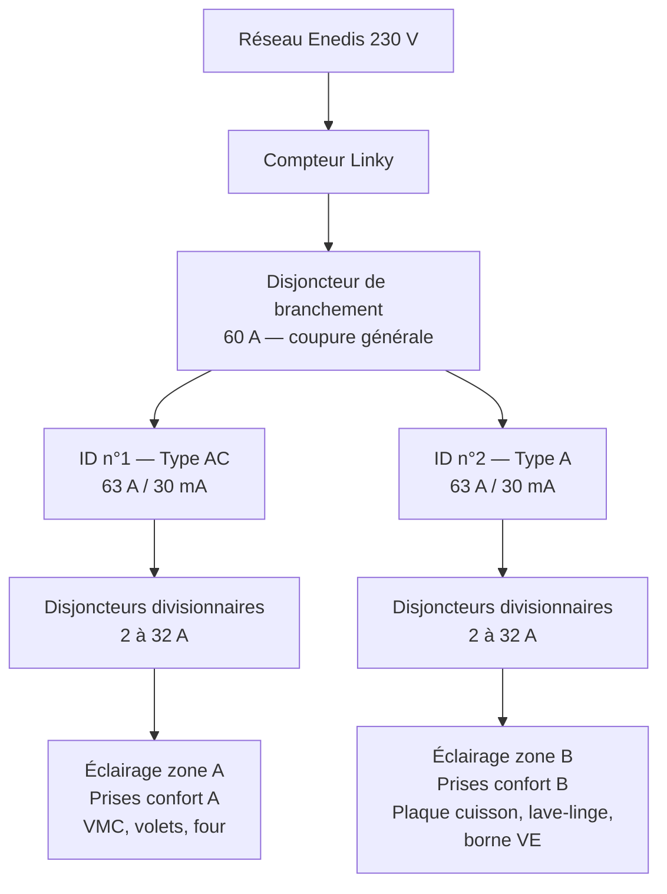

# Électricité domestique

!!! abstract "Ressource de référence"

    Document basé sur le [Guide Legrand de la norme NF C 15-100](assets/legrand-guide-nf-c-15-100.pdf "Guide Legrand NF C 15-100 — révision 23 août 2024"),
    révision du **23 août 2024**.

---

## 1. Le courant électrique : rappels fondamentaux

### Nature du courant domestique

Le courant délivré par le réseau (EDF/Enedis) jusqu'au disjoncteur général est un **courant alternatif sinusoïdal** :

- Tension efficace : **230 V** (la tension oscille entre +325 V et −325 V, la valeur de 230 V étant la valeur efficace, ou RMS).
- Fréquence : **50 Hz** (50 cycles complets par seconde).

### Loi d'Ohm et puissance

La relation fondamentale à retenir :

$$ P = U \times I $$

- *P* = puissance (watts)
- *U* = tension (volts)
- *I* = intensité (ampères)

**Exemple concret** : une ampoule LED de 8 W sous 230 V consomme une intensité de seulement *I = P/U ≈ 0,035 A* (35 mA). C'est pourquoi les LED permettent de multiplier les points lumineux sans surcharger un circuit.

### Phase, neutre, terre

- **Phase** : conducteur actif qui amène le potentiel (230 V par rapport à la terre).
- **Neutre** : conducteur de retour, théoriquement au potentiel 0 V.
- **Terre** : conducteur de protection (PE), qui évacue les défauts vers le piquet de terre.

!!! warning "Ne jamais confondre neutre et terre"

    Le courant qui revient par le neutre après avoir traversé un équipement est parfois qualifié *d'électricité sale* dans le langage courant : il ne doit pas être réinjecté vers d'autres équipements, mais renvoyé au distributeur.

    En pratique, cela se traduit par une règle simple : **on ne chaîne jamais un équipement sur le neutre d'un autre de manière anarchique, et on ne confond jamais neutre et terre.**

---

## 2. Code couleur des conducteurs

| Rôle | Couleurs admises |
|---|---|
| **Phase principale** | Rouge, noir, **marron** (= brun) |
| **Phase secondaire / navette** | Orange, violet (ou toute couleur hors bleu/vert-jaune) |
| **Neutre** | **Bleu** exclusivement |
| **Terre (PE)** | **Vert/jaune** exclusivement |

### Cas du va-et-vient

Dans un montage va-et-vient à deux interrupteurs :

- Les **navettes** (entre les deux interrupteurs) peuvent être en **orange**.
- Le **retour lampe** (sortie du 2ᵉ interrupteur vers le point lumineux) peut être en **violet**.

Règle de lecture : le **bleu** et le **vert/jaune** sont *exclusivement réservés* au neutre et à la terre. Toutes les autres couleurs peuvent servir de phase.

---

## 3. Le tableau électrique (GTL)

### Vocabulaire

- **GTL** (Gaine Technique Logement) : la « grande goulotte » verticale qui contient le tableau électrique, le compteur, et les arrivées.
- **Disjoncteur général** = **disjoncteur d'abonné** = **disjoncteur de branchement** : ce sont **des synonymes**. C'est la protection principale en tête d'installation.
- **Dérivation** = **parallèle** : termes interchangeables pour désigner un branchement où plusieurs équipements sont alimentés par une même ligne.

### Architecture type

> Pour le détail normatif : [guide Legrand p. 20 — *Le tableau électrique*](assets/legrand-guide-nf-c-15-100.pdf).

### Différentiels vs divisionnaires : qui protège quoi ?

Deux familles de protections cohabitent dans un tableau, à deux étages :

| | Interrupteur différentiel (ID) | Disjoncteur divisionnaire |
|---|---|---|
| **Détecte** | Une fuite de courant vers la terre (≥ 30 mA) | Une surcharge ou un court-circuit |
| **Protège** | **Les personnes** (électrocution) | **Les conducteurs et l'installation** (échauffement, incendie) |
| **Calibre** | 25 / 40 / 63 A (intensité de passage) | 2 / 10 / 16 / 20 / 32 A (selon le circuit) |
| **Position** | En tête d'un groupe de circuits | Un par circuit, en aval de l'ID |

Le disjoncteur de branchement coupe **tout** en cas de gros défaut amont. Sous lui, **chaque ID** surveille les fuites à la terre d'un groupe de circuits. Sous chaque ID, **un disjoncteur divisionnaire par circuit** protège le câblage contre la surintensité.

> Voir [guide Legrand p. 12 — *La protection des personnes*](assets/legrand-guide-nf-c-15-100.pdf) et [p. 16 — *La protection des circuits*](assets/legrand-guide-nf-c-15-100.pdf) pour le détail normatif.

### Les interrupteurs différentiels (ID)

Il s'agit de dispositifs 30 mA qui protègent les personnes contre les contacts indirects (fuite de courant vers la terre).

**Au minimum 2 ID par logement, dont au moins 1 de type A** (règle NF C 15-100).

Il existe en réalité **4 types** d'interrupteurs différentiels, mais en résidentiel classique on n'utilise que les deux premiers :

| Type | Usage |
|---|---|
| **Type AC** | Circuits « classiques » : éclairage, prises de confort, volets roulants, VMC, chauffage électrique, chauffe-eau, chaudière… |
| **Type A** | Circuits avec électronique susceptible de générer des défauts mono-alternance : **plaques de cuisson, lave-linge, sèche-linge, four, lave-vaisselle, borne de recharge VE** (véhicule électrique). **Obligatoire** pour ces usages — voir [NF C 15-100-7-722](https://www.boutique.afnor.org/fr-fr/norme/nf-c151007722/installations-electriques-a-basse-tension-partie-7722-regles-pour-les-/fa194858/82203) pour l'IRVE. |
| **Type F** | Équipements avec variateur de vitesse monophasé (ex. certaines pompes à chaleur, climatiseurs). Peut remplacer un type A. |
| **Type B** | Équipements avec redresseur triphasé ou variateur triphasé (recharge VE en mode 3 triphasé, photovoltaïque sans stockage). Usage rare en résidentiel. |

!!! info "Pourquoi un Type A pour les équipements à électronique ?"

    Plaques à induction, lave-linge à variateur, four pyrolyse, borne de recharge VE… contiennent des **redresseurs** ou des **variateurs électroniques**. En cas de défaut, le courant qui s'échappe vers la terre n'est plus un sinusoïde « propre » mais comporte une **composante continue** ou se présente en **demi-onde (mono-alternance)**.

    Le tore d'un différentiel **Type AC** ne détecte que les variations purement alternatives. Une composante continue **sature magnétiquement** ce tore : l'ID **ne déclenche plus**, même en présence d'un défaut dangereux.

    Le **Type A** intègre un dispositif complémentaire qui voit aussi les défauts pulsés et à composante continue partielle, d'où son obligation pour ces usages. Un Type A protège également ce qu'un Type AC protège — un tableau peut donc être entièrement équipé en Type A.

### Principe de redondance / répartition

La norme impose de **répartir les circuits entre plusieurs différentiels** pour que la panne d'un seul ID ne coupe pas toute la maison :

- L'éclairage d'une même pièce doit être réparti : certains points lumineux sur l'ID n°1, d'autres sur l'ID n°2.
- Idem pour les prises de confort.
- **Maximum 8 circuits** protégés par un même interrupteur différentiel (règle NF C 15-100).

### Dimensionnement du différentiel

Deux méthodes admises par la norme :

**Règle de l'amont** (la plus simple et la plus courante) : l'intensité de l'ID doit être **≥** l'intensité du disjoncteur de branchement.

- Ex. : disjoncteur de branchement 60 A → ID de 63 A.

**Règle de l'aval** (permet d'utiliser des ID plus petits, ex. 40 A) : l'intensité de l'ID doit être supérieure ou égale à la somme pondérée des courants des circuits qu'il protège :

$$ I_{ID} \geq \sum I_{chauffage} + 0{,}5 \times \sum I_{autres} $$

**Exemple** : 1 convecteur 20 A + 1 circuit prise 16 A + 1 circuit lumière 10 A
→ (1 × 20) + (0,5 × (16 + 10)) = 20 + 13 = **33 A** → un ID **40 A** suffit.

!!! info "Évolution Linky"

    Avec le déploiement du Linky, le disjoncteur de branchement **monocalibre 60 A** remplace progressivement les anciens 30/45/60 A réglables. Un ID de 63 A en tête de groupe reste la solution la plus sûre si on ne veut pas refaire le calcul de dimensionnement.

### Pouvoir de coupure

Le **pouvoir de coupure** (kA) est la capacité d'un disjoncteur à interrompre un court-circuit.

- **4,5 kA** : suffisant pour la plupart des installations domestiques, notamment en rénovation ou installations anciennes.
- **6 kA / 10 kA** : pour installations proches d'un transformateur ou neuves très exigeantes.

### Tableau de terre

Le bornier de terre du tableau est relié à l'installation de terre via :

- Un conducteur de **16 mm²** (cuivre) entre le bornier du tableau et la **barrette de coupure de terre** (la norme exige une section ≥ 6 mm² ; le 16 mm² est la valeur usuellement retenue, dimensionnée par rapport à la phase).
- Un conducteur de **25 mm² en cuivre nu** jusqu'au piquet de terre (ou boucle à fond de fouille).

!!! tip "Astuce terrain — qualité de la prise de terre"

    Une **boucle de cuivre nu de 25 mm² en fond de fouille** offre une bien meilleure résistance qu'un simple piquet enfoncé. Plus la résistance de terre est élevée, plus le différentiel doit être sensible.

    Voir le tableau *résistance de terre / sensibilité du différentiel* dans le [guide Legrand p. 4](assets/legrand-guide-nf-c-15-100.pdf).

Le piquet de terre doit faire **2 m minimum** de profondeur.

La **barrette de coupure de terre** doit être :

- **Accessible et visible** (pour permettre la mesure de la résistance de terre).
- Installée dans un endroit sec, avec distances de sécurité respectées.

### Test mensuel

Les interrupteurs différentiels doivent être **testés une fois par mois** en appuyant sur le bouton « Test » : l'ID doit déclencher immédiatement. Sinon, il doit être remplacé.

---

## 4. Circuits et dimensionnement

### Principales règles de section et protection

| Usage | Section (mm²) | Disjoncteur | Limite |
|---|---|---|---|
| Éclairage | 1,5 | 16 A max (souvent 10 A) | **8 points lumineux max/circuit** ; **2 circuits min/logement** |
| Prises (en 1,5 mm²) | 1,5 | 16 A | **8 prises max/circuit** |
| Prises (en 2,5 mm²) | 2,5 | 20 A | **12 prises max/circuit** |
| Prises cuisine | 2,5 | 20 A | **6 prises max/circuit** (hors circuits spécialisés) |
| VMC | 1,5 | 2 A (dédié) | — |
| Plaque de cuisson | 6 | 32 A | Circuit dédié |
| Four | 2,5 | **20 A** | Circuit dédié (un 32 A est surdimensionné ; vérifier la plaque signalétique de l'appareil) |
| Lave-linge / lave-vaisselle / sèche-linge | 2,5 | 20 A | 1 circuit dédié par appareil ; **min. 3 circuits spécialisés par logement** |
| Chauffage électrique | 1,5 → 6 selon puissance | 16 → 32 A | 1 circuit dédié par **tranche de puissance**, dont la valeur dépend du couple section/calibre : 1,5/16A → 3500 W ; 2,5/20A → 4500 W ; 4/25A → 5750 W ; 6/32A → 7250 W |
| Prise recharge VE Green'up | 2,5 | 20 A | 1 circuit dédié (Type A ou F minimum) |
| Volets roulants | 1,5 | 16 A | **1 circuit dédié min.** |

> Pour le détail circuit par circuit (lumières, prises, volets, chauffage, recharge VE), voir [guide Legrand p. 22 à 28 et p. 34](assets/legrand-guide-nf-c-15-100.pdf).

### Volets roulants

Les volets roulants sont sur **leur(s) propre(s) ligne(s)**, indépendantes de l'éclairage et des prises. En cas de plusieurs groupes de volets, on équilibre entre ID type A et type AC.

### Alimentation d'une annexe / dépendance

Pour alimenter un bâtiment annexe (abri de jardin, atelier, etc.), la section dépend de la puissance à fournir et de la longueur de la ligne (chute de tension à calculer) :

- **10 mm²** : section usuelle pour des distances courtes et une puissance modérée.
- **16 mm²** : pour distances plus longues ou puissances importantes.

---

## 5. Câbles et conducteurs

### Rigide vs souple

- **Dans les murs et gaines encastrées** : on utilise **exclusivement du fil rigide (mono-brin)**, type **H07V-U**.
- **Câblage mobile / raccordement d'appareils** : fil souple (multi-brins), type H07V-K, nécessitant des embouts de câblage sertis pour être raccordé en bornier.

### Dénudage — précautions

- **Ne jamais entailler la section du conducteur** : une entaille réduit la section utile, provoque un échauffement local et peut causer une rupture ou un incendie.
- Utiliser une **pince à dénuder bien réglée** (pince automatique ou réglable selon la section).
- La **longueur de dénudage** est indiquée directement sur l'appareil (disjoncteur, prise, interrupteur) via un gabarit imprimé. Astuce : dénuder **plus long que nécessaire**, puis recouper à la bonne longueur avec la pince coupante.

### Pince Jokari

Outil spécifique et très pratique (*Jokari* est une marque historique ; le terme générique est « pince à dénuder pour câbles ronds ») :

- Permet de dénuder la gaine extérieure d'un câble multi-conducteurs sans abîmer l'isolant des brins internes.
- Comporte un **« bec de perroquet »** (crochet) qui permet de fendre proprement une **gaine ICTA** (gaine annelée souple, **généralement grise en pose apparente, orange en encastré**).

---

## 6. Prises de courant et interrupteurs

### Règles de pose

- **Hauteur minimale** des prises (mesurée à l'axe) :
    - **5 cm du sol fini** pour les prises ≤ 20 A (prises classiques 16/20 A).
    - **12 cm du sol fini** pour les prises > 20 A (prises 32 A, plaques de cuisson).
- **Hauteur des commandes** (interrupteurs, commandes de volets) : **entre 90 cm et 130 cm** du sol fini (règle d'accessibilité).
- **Orientation de la terre** : la broche de terre (mâle, sur la prise murale) est orientée **vers le haut** — c'est la convention française.

### Boîtes d'encastrement

- Les anciennes **fixations par griffes** (qui se coinçaient contre la plaque de plâtre) sont **interdites dans le neuf** (et en rénovation importante).
- On utilise désormais des **boîtes d'encastrement à vis** : 4 vis au total — 2 pour fixer la boîte au mur, 2 pour fixer l'appareillage (prise ou interrupteur) sur la boîte.
- **Trou de passage** : réalisé à la **scie-cloche de 68 mm** (diamètre standard pour boîte simple).

### Bornes de raccordement

- Les **borniers à vis** sont en voie de disparition dans l'appareillage moderne (ils restent autorisés mais nécessitent une vérification du couple de serrage).
- Les **borniers automatiques** (à ressort, type Wago ou intégrés) sont la norme actuelle : pas de serrage à vérifier, contact maintenu dans le temps.

### Interrupteurs

- **Tous les interrupteurs modernes sont mécaniquement des va-et-vient** (3 bornes : L, 1, 2), même quand un seul point de commande est utilisé. Les anciens interrupteurs « simple allumage » à bascule rémanente n'existent plus dans les gammes actuelles.
- Dans un va-et-vient :
    - **L** = borne de ligne (entrée ou retour lampe selon la position dans le circuit).
    - **1 et 2** = bornes des **navettes** (liaison entre les deux interrupteurs).
    - **Seule la phase transite par les va-et-vient** : le neutre va directement au point lumineux.

### Télérupteur

Dès qu'on dépasse **2 points de commande** pour un même éclairage (3 interrupteurs ou plus), le va-et-vient classique ne suffit plus :

- On utilise un **télérupteur** (ou une minuterie, selon l'usage) placé dans le tableau.
- Les boutons-poussoirs sont alors des **BP** (boutons-poussoirs momentanés), **pas** des va-et-vient. Chaque appui bascule l'état du télérupteur.

### DCL (Dispositif de Connexion pour Luminaire)

- **Obligatoire sur tous les points lumineux** dans le neuf et en rénovation totale.
- Il s'agit d'une prise femelle (socle DCL) qui permet de connecter/déconnecter un luminaire sans intervention sur les conducteurs. Le luminaire est fourni avec une fiche mâle DCL.

---

## 7. Outillage — testeurs et protections

### Testeurs

| Outil | Usage |
|---|---|
| **VAT** (Vérificateur d'Absence de Tension) | Test avant intervention — obligatoire pour les pros, moins utile pour un particulier. |
| **Détecteur de tension AC** (sans contact ou à pointe) | Vérifier rapidement la présence de phase dans une prise ou sur un fil. |
| **Testeur de prise** (ex. MS6860D) | Se branche dans une prise et affiche via voyants : phase/neutre correctement câblés, terre présente, inversions éventuelles. **Excellent outil de contrôle final**. |
| **Multimètre** | Mesures de tension, résistance, continuité — indispensable pour le diagnostic. |

### Outils isolés

- Pinces, tournevis, coupe-câbles peuvent être **isolés 1000 V** (manche en plastique bicolore spécifique).
- La mention d'isolation (ex. « 1000 V » + pictogramme) est **imprimée/gravée sur l'outil**. **Toujours vérifier** avant d'intervenir sous tension (même si par principe on coupe toujours le courant avant intervention).

---

## 8. Techniques et astuces terrain

### Recherche / identification d'une ligne

Pour identifier à quel disjoncteur correspond une prise ou un point lumineux :

1. **Couper le disjoncteur général**.
2. Au tableau, **shunter phase et neutre** du circuit à identifier (les relier ensemble).
3. À l'autre extrémité (prise ou point lumineux), mesurer la **continuité** avec un multimètre en mode « sonnerie » / ohmmètre.
4. Une résistance proche de 0 Ω (et la sonnerie qui s'active) confirme que c'est bien la bonne ligne.

!!! danger "Sécurité"

    Cette manipulation ne se fait **qu'avec le disjoncteur général coupé et vérifié hors tension au VAT**. Aucune exception.

---

## 9. Faire appel à un électricien professionnel

Lors de la signature d'un devis, l'électricien doit :

- **Détailler précisément les prestations** (fournitures, main-d'œuvre, mise aux normes éventuelle).
- Fournir, sur demande, son **attestation de vigilance URSSAF** et son numéro **SIRET**.
- Pour les travaux soumis au **[Consuel](https://www.consuel.com/)** (neuf, rénovation totale), fournir l'**attestation de conformité Consuel** à la fin du chantier.

---

## Pour aller plus loin

### Textes normatifs

- [NF C 15-100 — Installations électriques à basse tension](https://www.boutique.afnor.org/fr-fr/norme/nf-c15100/installations-electriques-a-basse-tension/fa195159/41737) (Afnor)
- [NF C 15-100-7-722 — Alimentation des véhicules électriques (IRVE)](https://www.boutique.afnor.org/fr-fr/norme/nf-c151007722/installations-electriques-a-basse-tension-partie-7722-regles-pour-les-/fa194858/82203) (Afnor)
- [Guide UTE C 15-105 — Détermination pratique des sections](https://www.boutique.afnor.org/fr-fr/norme/ute-c-15105/installations-electriques-a-basse-tension-guide-pratique-determination-/fa098251/22473) (Afnor)

### Documentation pédagogique

- [Promotelec](https://www.promotelec.com/) — vulgarisation et fiches pratiques NF C 15-100.
- [Consuel](https://www.consuel.com/) — organisme de contrôle des installations neuves.

### Documentation des fabricants

- [Schneider Electric — France](https://www.se.com/fr/fr/)
- [Legrand — France](https://www.legrand.fr/)
- [Hager — France](https://hager.com/fr)

### Document local

- [Guide Legrand NF C 15-100 — révision du 23 août 2024 (PDF)](assets/legrand-guide-nf-c-15-100.pdf "Guide Legrand NF C 15-100 — révision 23 août 2024")

---

*Document de synthèse à visée pédagogique, sans valeur normative, établi sur la base du Guide Legrand NF C 15-100 — révision du 23 août 2024. En cas de doute sur une intervention, consulter un électricien qualifié et se référer aux textes normatifs en vigueur.*

*[GTL]: Gaine Technique Logement
*[ID]: Interrupteur Différentiel
*[DCL]: Dispositif de Connexion pour Luminaire
*[IRVE]: Infrastructure de Recharge pour Véhicule Électrique
*[VE]: Véhicule Électrique
*[VAT]: Vérificateur d'Absence de Tension
*[BP]: Bouton-Poussoir
*[ICTA]: Isolant Cintrable Transversalement Annelé
*[PE]: conducteur de Protection Équipotentielle (terre)
*[RMS]: Root Mean Square (valeur efficace)
*[VMC]: Ventilation Mécanique Contrôlée

